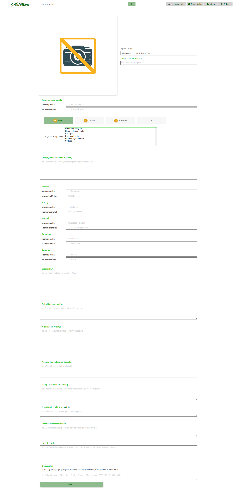

# HerbaLand

Aplikacja dla tych, którzy chcą dowiedzieć się więcej na temat medycyny naturalnej w możliwie najprostszej formie,
którą ma zapewnić mapa kategorii, do których przypisana została każda roślina lecznicza opisana w prostej, zwięzłej i 
czytelnej formie.

## Wgląd w aplikację
#### 1. Widoki dostępne dla zalogowanych bez roli ADMIN i niezalogowanych użytkowników
1. Podgląd wybranej rośliny leczniczej
   

#### 2. Widoki dostępne dla niezalogowanych użytkowników
1. Strona główna
   

2. Strona logowania
   

3. Strona rejestracji
   

#### 3. Widoki dostępne dla zalogowanych użytkowników
1. Strona główna
   

2. Strona zawierająca listę ulubionych roślin leczniczych użytkownika
   

#### 4. Widoki dostępne wyłącznie dla zalogowanego administratora
1. Strona główna z dialogiem zapisującym nowy plik MP4
   

2. Podgląd wybranej rośliny leczniczej
   

3. Strona umożliwiająca edycję wybranej rośliny leczniczej
   

4. Strona umożliwiająca edycję wybranej kategorii
   

5. Strona umożliwiająca utworzenie nowej rośliny leczniczej
   

## Technologie

* Spring Boot
* Spring Security
* Spring Data JPA
* Hibernate
* MySQL
* Java Server Pages (JSP)
* JSP Standard Tag Library (JSTL)
* JavaScript
* JQuery
* CSS
* HTML
* JUnit 5

## Lokalne uruchamianie aplikacji

### Wymagania niefunkcjonalne:
1.	Działanie na dowolnej przeglądarce.
2.	Dostęp do Internetu.
3.	Działanie w środowisku Java w wersji 19.
4.	Otwarte połączenie do bazy danych MySQL w wersji 3.9.2.
5.	Zainstalowany program Apache Maven w wersji 8.0.32.

* Należy uzupełnić informację dotyczące połączenia z bazą danych<br>
  w katalogu src/main/resources:

  ```
  application.properties
  
  Uzupełnij nazwę użytkownika do swojej lokalnej bazy danych:
  spring.datasource.username=
  ```

  ```
  application.properties
  
  Uzupełnij hasło do swojej lokalnej bazy danych:
  spring.datasource.password=
  ```

  ```
  application.properties
  
  Jeżeli korzystasz z MySQL, upewnij się, że nie masz uruchomionej bazy danych na innym porcie
  (projekt ustawiony jest na domyślnym dla MySQL porcie: 3306)
  spring.datasource.url=jdbc:mysql://localhost:3306/herbaLand?...
  ```

* Utworzenie bazy danych:<br>
W katalogu src/main/resources/META-INF/database znajdziemy:
    * herbaland-schema.sql - schema utworzonej przeze mnie bazy danych
    * herbaland - pliki do importu przygotowanych przeze mnie danych do zasilenia bazy danych

* Uruchamianie:
    * z użyciem maven: <strong>mvn package spring-boot:run</strong>
    * z użyciem java -jar: <strong>java -jar target/herbaland-0.0.1-SNAPSHOT.jar</strong>
    * "ręcznie" uruchom w swoim IDE plik HerbaLandApplication.class z katalogu src/main/java/pl/vistula/herbaland

## Spring security

Po utworzeniu kompletnej bazy danych, możliwe będzie zalogowanie się na:
* zwykłego użytkownika z rolą USER:

  ```
  Użytkownik: Jan Kowalski

  Email: jan@o2.pl
  Hasło: 12345678
  ```
* administratora z rolą ADMIN oraz USER
  ```
  Użytkownik: Zofia Wasilonek

  Email: admin@gmail.com
  Hasło: adminpass
  ```

## Kontakt

zofiawasilonek@gmail.com<br>
<a href="https://www.linkedin.com/in/zofia-wasilonek/">Linkedin</a>